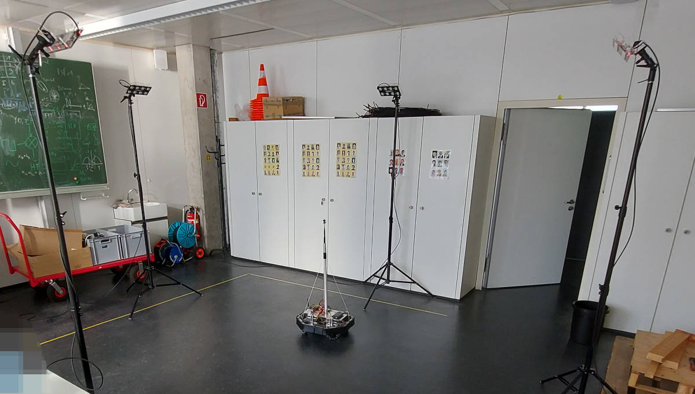
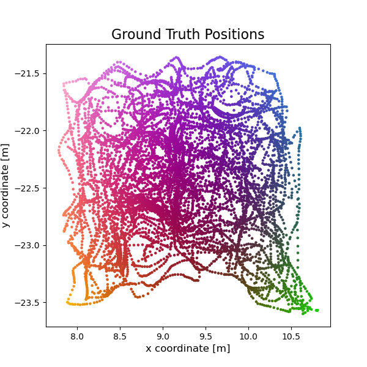
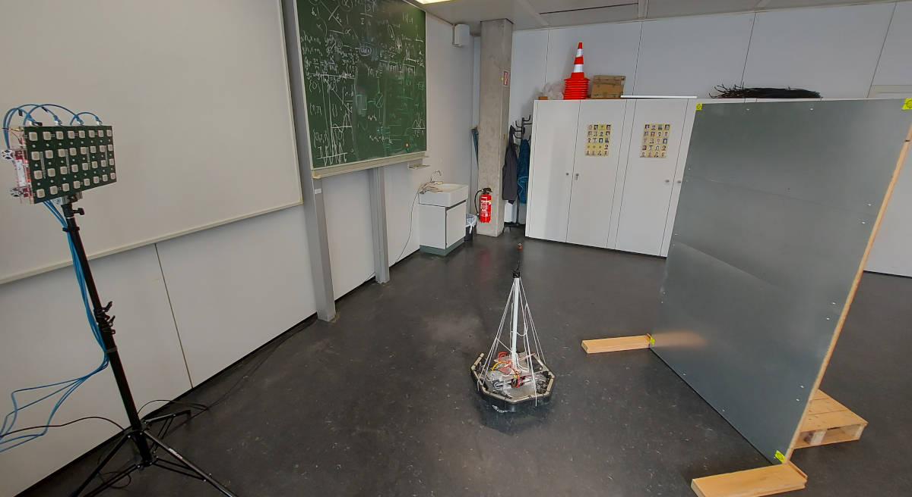
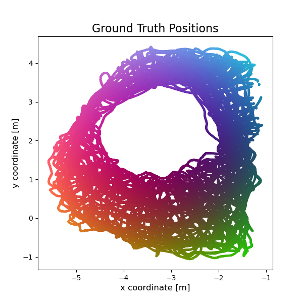

# Demo: Channel Charting with WiFi CSI Datasets generated by ESPARGOS


This repository demonstrates how to apply Channel Charting to WiFi Channel State Information datasets captured with [ESPARGOS](https://espargos.net/).

The Jupyter Notebook `TripletNeuralNetwork.ipynb` is also the source code for the results presented in the paper

> Florian Euchner, Stephan ten Brink: "ESPARGOS: Phase-Coherent WiFi CSI Datasets for Wireless Sensing Research"

All WiFi CSI data is for 40 MHz wide WiFi channels at 2.4GHz.

**Objective**: Achieve absolute or at least relative localization of the transmitter using Channel Charting.

## Summary and Results

### Siamese Neural Network-based "Augmented" Channel Charting applied to [`espargos-0001`](https://espargos.net/datasets/data/espargos-0001/): `SiameseNeuralNetwork.ipynb`
* Four distributed 4 &times; 2 ESPARGOS antenna arrays, dominant LoS path
* ["AoA-Augmented Channel Charting"](https://github.com/Jeija/ToA-AoA-Augmented-ChannelCharting/): Siamese Neural Network-based Channel Charting (with fused CSI-based / timestamp-based dissimilarity metric) is augmented by classical triangulation



<table>
    <tr>
        <th style="text-align: center;">Training Animation</th>
        <th style="text-align: center;">Top View Map</th>
        <th style="text-align: center;">Typ. Performance</th>
    </tr>
    <tr>
        <td style="text-align: center;"></td>
        <td style="text-align: center;"></td>
        <td style="text-align: center;">
            <table>
                <tr>
                    <td>CT</td>
                    <td>0.99</td>
                </tr>
                <tr>
                    <td>TW</td>
                    <td>0.99</td>
                </tr>
                <tr>
                    <td>KS</td>
                    <td>0.10</td>
                </tr>
                <tr>
                    <td>MAE</td>
                    <td>0.13m</td>
                </tr>
                <tr>
                    <td>CEP</td>
                    <td>0.12m</td>
                </tr>
            </table>
        </td>
    </tr>
</table>

CT = Continuity, TW = Trustworthiness, KS = Kruskal Stress, MAE = Mean Absolute Error, CEP = Circular Error Probable

### Triplet Neural Network-based Channel Charting applied to [`espargos-0002`](https://espargos.net/datasets/data/espargos-0002/): `TripletNeuralNetwork.ipynb`
* One large 8 &times; 4 ESPARGOS antenna array
* Metal wall to ensure NLoS propagation in large parts of measurement area (whenever robot is behind wall from point of view of antenna array)
* Triplet Neural Network learns channel chart based on CSI data and timestamps
* No augmentation with model-based approach: The channel chart coordinates can be arbitrarily translated / rotated / scaled / flipped (affine transformation) compared to the true physical coordinates.



<table>
    <tr>
        <th style="text-align: center;">Training Animation</th>
        <th style="text-align: center;">Top View Map</th>
        <th style="text-align: center;">Typ. Performance</th>
    </tr>
    <tr>
        <td style="text-align: center;"></td>
        <td style="text-align: center;"></td>
        <td style="text-align: center;">
            <table>
                <tr>
                    <td>CT</td>
                    <td>0.96</td>
                </tr>
                <tr>
                    <td>TW</td>
                    <td>0.96</td>
                </tr>
                <tr>
                    <td>KS</td>
                    <td>0.20</td>
                </tr>
                <tr>
                    <td>MAE*</td>
                    <td>0.44m</td>
                </tr>
                <tr>
                    <td>CEP*</td>
                    <td>0.42m</td>
                </tr>
            </table>
        </td>
    </tr>
</table>

CT = Continuity, TW = Trustworthiness, KS = Kruskal Stress, MAE = Mean Absolute Error, CEP = Circular Error Probable

\* = after optimal affine transformation from Channel Chart coordinates to physical coordinates is applied

### Prerequisites
Our code is based on Python, TensorFlow, NumPy, SciPy and Matplotlib.
Source files are provided as Jupyter Notebooks, which can be opened directly here on GitHub or using e.g. [https://jupyter.org/](JupyterLab).

We run our Channel Charting experiments on a JupyterHub server with NVMe storage, AMD EPYC 7262 8-Core Processor, 64GB RAM, and a NVIDIA GeForce RTX 4080 GPU for accelerating TensorFlow.
All indications of computation times are measured on this system.
It should also be possible to run our notebooks on less performant systems.

### Citation
```
@inproceedings{euchner2024espargos,
	author    = {Euchner, Florian and ten Brink, Stephan},
	title     = {{ESPARGOS: Phase-Coherent WiFi CSI Datasets for Wireless Sensing Research}},
	booktitle = {Kleinheubacher Tagung},
	year      = {2024}
}
```

### Other Resources
* [Christoph Studer's Channel Charting Website](https://channelcharting.github.io/)
* [Original ESPARGOS Introduction Paper](https://ieeexplore.ieee.org/abstract/document/10104556)
* [ESPARGOS Website](https://espargos.net/)
* [Our tutorial on dissimilarity metric-based Channel Charting](https://dichasus.inue.uni-stuttgart.de/tutorials/tutorial/dissimilarity-metric-channelcharting/)
* [Our tutorial on Triplet Neural Network-based Channel Charting](https://dichasus.inue.uni-stuttgart.de/tutorials/tutorial/channelcharting/)
* [Good recent paper on joint ToA / AoA-based localization](https://arxiv.org/pdf/2207.08512.pdf)